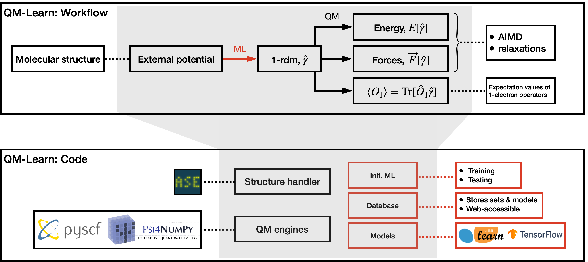

# QMLearn

*Quantum Machine Learning* by learning one-body reduced density matrices in the AO basis.

# Contributors
 - Xuecheng Shao, Lukas Paetow, Md Rajib Khan Musa, Jessica A. Martinez B. and Michele Pavanello @ [PRG](https://sites.rutgers.edu/prg/) at [Rutgers University-Newark](http://sasn.rutgers.edu).
 - Mark E Tuckerman @ [Tuckerman Research Group](https://wp.nyu.edu/tuckerman_group/) at [NYU](https://cas.nyu.edu/)

# Some info

 Code entirely in Python leveraging [PySCF](https://pyscf.org/) and [Psi4Numpy](https://github.com/psi4/psi4numpy) for generating GTO integrals and DFT targets. Regressions are carried out with [scikit-learn](https://scikit-learn.org/stable/) or other ML tools.
